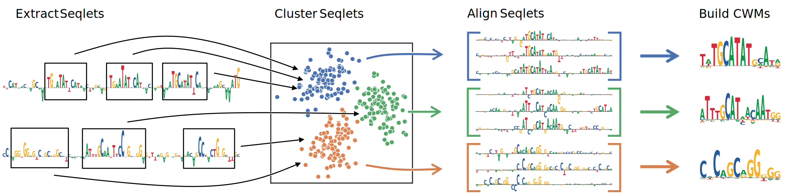

# TF-MoDISco

TF-MoDISco (**T**ranscription **F**actor **Mo**tif **D**iscovery from **I**mportance **Sco**res) is an algorithm for discovering sequence motifs from machine-learning-model-derived importance scores. Unlike traditional motif discovery methods that rely solely on sequence enrichment, TF-MoDISco leverages context-aware importance scores to identify patterns.

These importance scores can be generated using various attribution methods, such as DeepLIFT or SHAP, applied to models like BPNet. The algorithm identifies high-importance regions (seqlets), clusters them into motifs, and provides a report comparing discovered motifs to known databases.

> [!IMPORTANT]  
> Starting from version v2, TF-MoDISco utilizes the [tfmodisco-lite](https://github.com/jmschrei/tfmodisco-lite/) implementation and interface. This implementation is significantly more memory efficient, and in many cases faster, than the original implementation. The original implementation (v0) is still available [here](https://github.com/kundajelab/tfmodisco/tree/v0-final).

## Algorithm Description

The TF-MoDISco algorithm starts with a set of importance scores on genomic sequences and performs the following tasks:

1. Identify high-importance windows of the sequences, termed "seqlets"
2. Divide the seqlets into positive and negative sets (metaclusters) based on the overall importance score of each seqlet
3. Cluster recurring similar seqlets
4. Generate motifs by aligning the clustered seqlets

During clustering, a coarse-grained similarity is calculated as the cosine similarity between gapped k-mer representations between all pairs of seqlets. This information is used to calculate the top nearest neighbors, for which a fine-grained similarity is calculated as the maximum Jaccard index as two seqlets are aligned with all possible offsets. This sparse similarity matrix is then density adapted, similarly to t-SNE, and Leiden clustering is used to extract patterns. Finally, some heuristics are used to merge similar patterns and split apart the seqlets comprising dissimilar ones.



## References

TF-MoDISco is described in:
> Wang, Tseng, Ramalingam, Schreiber, et al. "Decoding predictive motif lexicons and syntax from deep learning models of transcription factor binding profiles." (manuscript in preparation)

Related tools:
- [Fi-NeMo](https://github.com/kundajelab/Fi-NeMo): Motif instance detection using TF-MoDISco patterns
- [BPNet](https://github.com/kundajelab/bpnet-refactor): Deep learning models for TF binding prediction
- [ChromBPNet](https://github.com/kundajelab/chrombpnet): Deep learning models for chromatin accessibility prediction

## Installation

You can install TF-MoDISco using `pip install modisco`

## Running TF-MoDISco

You can run TF-MoDISco using the command line tool `modisco` which comes with the TF-MoDISco installation. This tool allows you to run TF-MoDISco on a set of sequences and corresponding attributions, and then to generate a report (like the one seen above) for the output generated from the first step.

`modisco motifs -s ohe.npz -a shap.npz -n 2000 -o modisco_results.h5`

This command will run modisco on the one-hot encoded sequences in `ohe.npz`, use the attributions from `shap.npz`, use a maximum of 2000 seqlets per metacluster (this is low, but a good starting point for testing the algorithm on your own data), and will output the results to `modisco_results.h5`. The one-hot encoded sequences and attributions are assumed to be in length-last format, i.e., have the shape (# examples, 4, sequence length). Note that you can also use `npy` files if you don't want to use compressed data for some reason. 

> [!TIP]
> By default, TF-MoDISco uses a window size of 400 around the center of each input region. You can override this default with `-w`.

The output saved in `modisco_results.h5` will include all of the patterns and has the following struture:

```
pos_patterns/
    pattern_0/
        sequence: [...]
        contrib_scores: [...]
        hypothetical_contribs: [...]
        seqlets/
            n_seqlets: [...]
            start: [...]
            end: [...]
            example_idx: [...]
            is_revcomp: [...]
            sequence: [...]
            contrib_scores: [...]
            hypothetical_contribs: [...]
        subpattern_0/
            ...
    pattern_1/
        ...
    ...
neg_patterns/
    pattern_0/
        ...
    pattern_1/
        ...
    ...
```

where `[...]` denotes that data is stored at that attribute. Importantly, the seqlets are all in the correct orientation. If a seqlet has been flipped to be the reverse complement, the sequence, contribution scores, and coordinates have also been flipped. In cases where there are not enough seqlets to consider a metacluster, that attribute (`neg_patterns` or `pos_patterns`) may not appear in the file.

## Generating reports

The TF-MoDISco report can be generated with the following command:
```sh
modisco report -i modisco_results.h5 -o report/ -s report/ -m motifs.txt
```

Each pattern produced by TF-MoDISco is compared against the database of motifs using [TOMTOM](https://meme-suite.org/meme/tools/tomtom). A good default choice is [this collection of human motifs](https://raw.githubusercontent.com/kundajelab/MotifCompendium/refs/heads/main/pipeline/data/MotifCompendium-Database-Human.meme.txt) produced by the [MotifCompendium](https://github.com/kundajelab/MotifCompendium) package.

The report details each pattern, including seqlet importance and spatial distributions, example seqlets at different importance levels, and motif visualizations.

For users who need the legacy report format use:
```sh
modisco report-simple -i modisco_results.h5 -o simple_report/ -s simple_report/ -m motifs.txt
```
